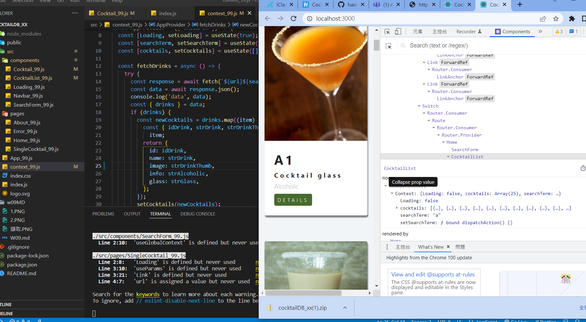
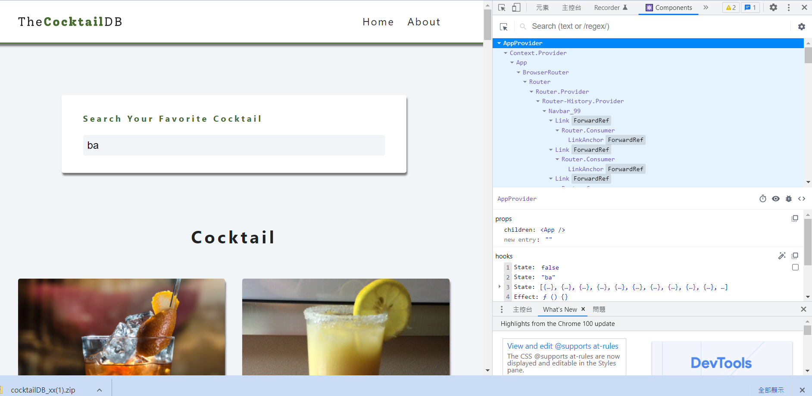

### w09-P1

### w09-P2 <About_xx /> <Error_xx /> <Navbar_xx />

### w09-P3 finish context.js and fetch data shown in DevTools

### w09-P4 Show Cocktails with your own searchTerm

### w09-P5 Show Cocktails using searchTerm

### w09-P6 All log message in Github

